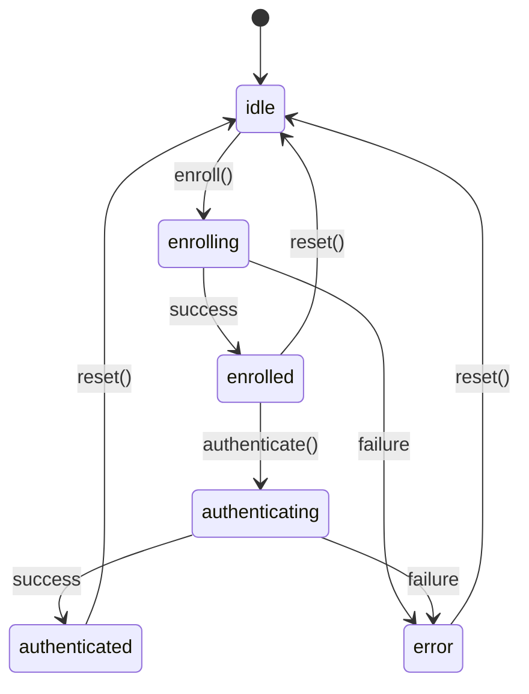

## Overview

This page provides detailed documentation for all methods and state values returned by the `useBioKey` hook.

## State Values

### identity

<ResponseField name="identity" type="object | null">
  The currently enrolled biometric identity. Returns `null` if no credential has been enrolled.
</ResponseField>

#### Type Definition

```typescript
interface Identity {
  publicKey: string        // Hex-encoded derived key
  credentialId: string     // Hex-encoded WebAuthn credential ID
  deviceId: string         // Device fingerprint (16 chars)
  enrolledAt: number       // Timestamp in milliseconds
  method: 'prf' | 'rawid'  // Key derivation method
}
```

#### Example

```jsx
const { identity } = useBioKey()

if (identity) {
  console.log('Public key:', identity.publicKey)
  console.log('Enrolled on:', new Date(identity.enrolledAt).toLocaleString())
  console.log('Device:', identity.deviceId)
  console.log('Method:', identity.method)
}
```

#### Storage

The identity object is automatically stored in `localStorage` with the key `biokey:{rpId}`. The hook reads this value on mount and updates it when enrollment succeeds.

---

### status

<ResponseField name="status" type="string">
  Current operation status indicating the state of the authentication flow.
</ResponseField>

#### Possible Values

| Value | Description |
|-------|-------------|
| `'idle'` | No operation in progress (initial state) |
| `'enrolling'` | Enrollment operation in progress |
| `'enrolled'` | Enrollment completed successfully |
| `'authenticating'` | Authentication operation in progress |
| `'authenticated'` | Authentication completed successfully |
| `'error'` | An error occurred during the last operation |

#### State Flow

```
idle → enrolling → enrolled
       ↓
       error

enrolled → authenticating → authenticated
           ↓
           error
```

#### Example

```jsx
const { status } = useBioKey()

const statusMessage = {
  idle: 'Ready to enroll',
  enrolling: 'Setting up your biometric...',
  enrolled: 'Biometric enrolled successfully!',
  authenticating: 'Verifying your identity...',
  authenticated: 'Welcome back!',
  error: 'Something went wrong'
}

return <div>{statusMessage[status]}</div>
```

---

### error

<ResponseField name="error" type="string | null">
  Error message from the last failed operation. Returns `null` when no error has occurred or after a successful operation.
</ResponseField>

#### When Errors Occur

The `error` state is set when:
- Enrollment fails (user cancels, hardware unavailable, etc.)
- Authentication fails (wrong credential, verification error, etc.)
- Network errors (when using server mode)
- WebAuthn API errors

#### Common Error Messages

```jsx
// Authentication without enrollment
"No enrolled credential. Call enroll() first."

// Biometric mismatch
"PRF key mismatch — identity verification failed."
"Key mismatch — identity verification failed."

// Server errors
"Server verification failed."
"Server public key mismatch."

// Browser/user errors
"User cancelled the operation"
"No available authenticator"
```

#### Example

```jsx
const { error, status } = useBioKey()

if (status === 'error' && error) {
  return (
    <div style={{ 
      padding: '12px', 
      background: '#fee', 
      border: '1px solid #c00',
      borderRadius: '4px'
    }}>
      <strong>Error:</strong> {error}
    </div>
  )
}
```

---

### isEnrolled

<ResponseField name="isEnrolled" type="boolean">
  Convenience boolean indicating whether a credential is currently enrolled. Equivalent to `!!identity`.
</ResponseField>

#### Example

```jsx
const { isEnrolled, enroll, authenticate } = useBioKey()

return (
  <div>
    {isEnrolled ? (
      <button onClick={() => authenticate('user-123')}>
        Sign In with Biometric
      </button>
    ) : (
      <button onClick={() => enroll('user-123')}>
        Set Up Biometric
      </button>
    )}
  </div>
)
```

---

### isLoading

<ResponseField name="isLoading" type="boolean">
  Convenience boolean indicating if an operation is in progress. Equivalent to `status === 'enrolling' || status === 'authenticating'`.
</ResponseField>

#### Example

```jsx
const { isLoading, enroll } = useBioKey()

return (
  <button onClick={() => enroll('user-123')} disabled={isLoading}>
    {isLoading ? (
      <>
        <Spinner /> Enrolling...
      </>
    ) : (
      'Enroll Biometric'
    )}
  </button>
)
```

---

## Methods

### enroll()

<ResponseField name="enroll" type="(userId?: string) => Promise<Identity>">
  Enrolls a new biometric credential and derives a cryptographic key.
</ResponseField>

#### Parameters

<ParamField path="userId" type="string" optional>
  Optional user identifier. If provided and `serverUrl` is configured, the enrollment will be synced with the server. If omitted, a random 16-byte ID is generated.
</ParamField>

#### Return Value

Returns a Promise that resolves to an Identity object:

```typescript
Promise<{
  publicKey: string
  credentialId: string
  deviceId: string
  enrolledAt: number
  method: 'prf' | 'rawid'
}>
```

#### Behavior

1. Sets `status` to `'enrolling'` and clears any previous `error`
2. Prompts the user for biometric authentication (Face ID, Touch ID, Windows Hello, etc.)
3. Creates a new WebAuthn credential with PRF extension
4. Derives a cryptographic key using either PRF or HKDF (fallback)
5. Stores the identity in localStorage
6. If `serverUrl` and `userId` are provided, sends enrollment to server
7. Updates `status` to `'enrolled'` and sets `identity` state
8. On error, sets `status` to `'error'`, sets `error` state, and throws

#### Example

```jsx
const { enroll, isLoading, error } = useBioKey({
  serverUrl: 'https://api.example.com'
})

const handleEnroll = async () => {
  try {
    const result = await enroll('user-123')
    console.log('Enrollment successful!')
    console.log('Public key:', result.publicKey)
    console.log('Credential ID:', result.credentialId)
    console.log('Device ID:', result.deviceId)
    console.log('Method used:', result.method)
  } catch (err) {
    console.error('Enrollment failed:', err.message)
    // Error is also available in the error state
  }
}

return (
  <button onClick={handleEnroll} disabled={isLoading}>
    {isLoading ? 'Enrolling...' : 'Enroll'}
  </button>
)
```

#### Notes

<Warning>
  **Platform Support**: The user's device must support WebAuthn platform authenticators (biometrics). If not available, the Promise will reject.
</Warning>

<Tip>
  **Server Sync**: Enrollment data is only sent to the server if both `serverUrl` and `userId` are provided. Network failures are silently caught to allow offline enrollment.
</Tip>

---

### authenticate()

<ResponseField name="authenticate" type="(userId?: string) => Promise<AuthResult>">
  Authenticates using the enrolled biometric credential and verifies the derived key.
</ResponseField>

#### Parameters

<ParamField path="userId" type="string" optional>
  Optional user identifier. If provided and `serverUrl` is configured, authentication will be verified with the server.
</ParamField>

#### Return Value

Returns a Promise that resolves to an authentication result:

```typescript
Promise<{
  verified: boolean
  publicKey: string
  method: 'prf' | 'rawid'
}>
```

#### Behavior

1. Checks if a credential is enrolled (throws error if not)
2. Sets `status` to `'authenticating'` and clears any previous `error`
3. Requests a challenge from the server (if `serverUrl` and `userId` provided) or generates one locally
4. Prompts the user for biometric verification
5. Re-derives the cryptographic key using the stored credential
6. Verifies the derived key matches the stored `publicKey`
7. If using server mode, sends the challenge response to server for verification
8. Updates `status` to `'authenticated'`
9. On error, sets `status` to `'error'`, sets `error` state, and throws

#### Example

```jsx
const { authenticate, isEnrolled, isLoading } = useBioKey({
  serverUrl: 'https://api.example.com'
})

const handleSignIn = async () => {
  if (!isEnrolled) {
    alert('Please enroll first')
    return
  }

  try {
    const result = await authenticate('user-123')
    if (result.verified) {
      console.log('Authentication successful!')
      console.log('Public key:', result.publicKey)
      console.log('Method:', result.method)
      // Proceed with login
    }
  } catch (err) {
    console.error('Authentication failed:', err.message)
  }
}

return (
  <button onClick={handleSignIn} disabled={isLoading}>
    {isLoading ? 'Authenticating...' : 'Sign In'}
  </button>
)
```

#### Error Cases

```jsx
// No credential enrolled
try {
  await authenticate('user-123')
} catch (err) {
  // err.message === "No enrolled credential. Call enroll() first."
}

// Key mismatch (wrong user/device)
try {
  await authenticate('user-123')
} catch (err) {
  // err.message === "PRF key mismatch — identity verification failed."
}

// Server verification failed
try {
  await authenticate('user-123')
} catch (err) {
  // err.message === "Server verification failed."
}
```

#### Notes

<Warning>
  **Requires Enrollment**: You must call `enroll()` successfully before calling `authenticate()`. The method will throw if no credential exists.
</Warning>

<Tip>
  **Key Verification**: The method automatically verifies that the re-derived key matches the stored key, providing cryptographic proof of identity.
</Tip>

---

### reset()

<ResponseField name="reset" type="() => void">
  Clears the stored identity and resets all state to initial values.
</ResponseField>

#### Parameters

None

#### Return Value

`void` - This method does not return a value.

#### Behavior

1. Calls `client.clearIdentity()` to remove identity from localStorage
2. Sets `identity` state to `null`
3. Sets `status` to `'idle'`
4. Sets `error` to `null`

#### Example

```jsx
const { reset, isEnrolled, identity } = useBioKey()

const handleRemoveCredential = () => {
  if (confirm('Remove your biometric credential?')) {
    reset()
    console.log('Credential removed')
  }
}

if (!isEnrolled) return null

return (
  <div>
    <p>Enrolled on: {new Date(identity.enrolledAt).toLocaleString()}</p>
    <button onClick={handleRemoveCredential}>
      Remove Credential
    </button>
  </div>
)
```

#### Use Cases

- User wants to remove their biometric credential
- Switching between different user accounts
- Error recovery (forcing re-enrollment)
- Logout functionality

#### Notes

<Warning>
  **Local Only**: This method only clears the client-side data. If you're using server mode, you should also call your server's API to remove the credential from the database.
</Warning>

<Note>
  **Immediate Effect**: The reset is synchronous and takes effect immediately. All state values are updated in the same render cycle.
</Note>

---

## Complete TypeScript Example

Here's a fully-typed example showing all methods and state:

```tsx
import { useBioKey } from 'biokey-react'
import { useState } from 'react'

interface AuthComponentProps {
  userId: string
  onSuccess: (publicKey: string) => void
}

const AuthComponent: React.FC<AuthComponentProps> = ({ userId, onSuccess }) => {
  const {
    identity,
    status,
    error,
    isEnrolled,
    isLoading,
    enroll,
    authenticate,
    reset
  } = useBioKey({
    rpId: 'example.com',
    rpName: 'My App',
    serverUrl: 'https://api.example.com'
  })

  const [lastAction, setLastAction] = useState<string>('')

  const handleEnroll = async () => {
    setLastAction('enroll')
    try {
      const result = await enroll(userId)
      console.log('Enrolled:', result.publicKey)
    } catch (err) {
      console.error('Enroll error:', err)
    }
  }

  const handleAuth = async () => {
    setLastAction('authenticate')
    try {
      const result = await authenticate(userId)
      if (result.verified) {
        onSuccess(result.publicKey)
      }
    } catch (err) {
      console.error('Auth error:', err)
    }
  }

  const handleReset = () => {
    setLastAction('reset')
    reset()
  }

  return (
    <div className="auth-container">
      <h2>Biometric Authentication</h2>
      
      {/* Status Display */}
      <div className="status-badge" data-status={status}>
        {status}
      </div>
      
      {/* Error Display */}
      {error && (
        <div className="error-message">
          <strong>Error:</strong> {error}
        </div>
      )}
      
      {/* Identity Info */}
      {identity && (
        <div className="identity-info">
          <div>Public Key: {identity.publicKey.slice(0, 16)}...</div>
          <div>Device: {identity.deviceId}</div>
          <div>Method: {identity.method.toUpperCase()}</div>
          <div>Enrolled: {new Date(identity.enrolledAt).toLocaleDateString()}</div>
        </div>
      )}
      
      {/* Action Buttons */}
      <div className="button-group">
        {!isEnrolled ? (
          <button 
            onClick={handleEnroll} 
            disabled={isLoading}
            className="btn-primary"
          >
            {isLoading && lastAction === 'enroll' 
              ? 'Enrolling...' 
              : 'Enroll Biometric'
            }
          </button>
        ) : (
          <>
            <button 
              onClick={handleAuth} 
              disabled={isLoading}
              className="btn-primary"
            >
              {isLoading && lastAction === 'authenticate' 
                ? 'Authenticating...' 
                : 'Authenticate'
              }
            </button>
            <button 
              onClick={handleReset} 
              disabled={isLoading}
              className="btn-secondary"
            >
              Remove Credential
            </button>
          </>
        )}
      </div>
    </div>
  )
}

export default AuthComponent
```

## State Machine Diagram

The hook follows a predictable state machine:



## Performance Considerations

### Client Instance

The hook uses `useRef` to maintain a single BioKeyClient instance across re-renders. This ensures:
- Options are only processed once
- No unnecessary re-initializations
- Stable reference for callbacks

### Callback Stability

All methods (`enroll`, `authenticate`, `reset`) are wrapped in `useCallback` with stable dependencies, making them safe to use in effect dependencies:

```jsx
const { authenticate } = useBioKey()

// This is safe - authenticate has a stable reference
useEffect(() => {
  // Auto-authenticate on mount if enrolled
  if (isEnrolled) {
    authenticate('user-123')
  }
}, [isEnrolled, authenticate])
```

## Best Practices

<Tip>
  **Check isEnrolled first**: Always verify `isEnrolled` is true before calling `authenticate()`.
</Tip>

<Tip>
  **Disable during operations**: Use `isLoading` to disable UI elements and prevent concurrent operations.
</Tip>

<Tip>
  **Handle both error patterns**: Check both the `error` state and use try-catch for comprehensive error handling.
</Tip>

<Warning>
  **Don't rely on status strings**: Use the provided boolean helpers (`isEnrolled`, `isLoading`) instead of comparing status strings directly.
</Warning>

## Next Steps

<CardGroup cols={2}>
  <Card title="useBioKey Hook" icon="hook" href="/api/biokey-react/use-biokey">
    Back to main hook documentation
  </Card>
  
  <Card title="BioKeyClient" icon="code" href="/api/biokey-js/biokey-client">
    Learn about the underlying client
  </Card>
  
  <Card title="React Guide" icon="react" href="/guides/react-integration">
    Complete React integration guide
  </Card>
  
  <Card title="Security Model" icon="shield" href="/concepts/security-model">
    Understand the security architecture
  </Card>
</CardGroup>
