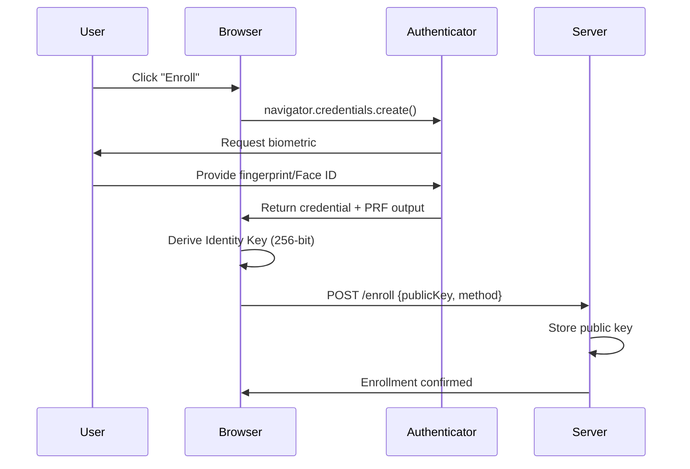
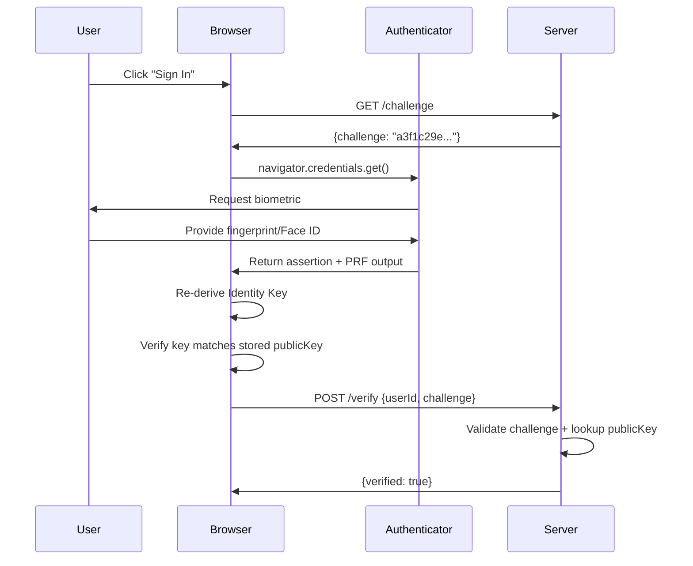

BioKey transforms your biometric authentication into a deterministic cryptographic identity—all without storing biometric data on any server.

## Overview

Unlike traditional authentication systems where biometrics unlock a stored key, BioKey derives the cryptographic identity **from the biometric authentication event itself**. This means:

- No biometric data ever leaves your device
- No keys stored in vendor clouds (iCloud, Google Password Manager)
- Your identity travels with your biometric, not your device
- The server only stores public keys, never secrets

## The Flow

Here's how BioKey works from enrollment to authentication:

### 1. Enrollment



**What happens during enrollment:**

1. Browser generates a random 32-byte challenge and 16-byte user ID
2. WebAuthn API triggers the platform authenticator (fingerprint sensor, Face ID)
3. User provides biometric authentication
4. Authenticator returns either:
   - **V2 (PRF)**: A hardware-backed 32-byte secret (preferred)
   - **V1 (rawId)**: A credential identifier to derive with HKDF (fallback)
5. Browser derives a 256-bit Identity Key from the authenticator response
6. Identity stored locally: `{credentialId, publicKey, deviceId, enrolledAt, method}`
7. Public key sent to server for future verification

### 2. Authentication



**What happens during authentication:**

1. Browser fetches a fresh challenge from server (32 bytes, single-use, 5-minute TTL)
2. WebAuthn API triggers platform authenticator with stored credential ID
3. User provides biometric authentication (same finger/face as enrollment)
4. Authenticator re-derives the same secret using PRF or rawId
5. Browser compares re-derived key against stored `publicKey`
6. If match: send challenge to server for verification
7. Server validates challenge and confirms identity

<Warning>
**Critical security check**: The browser MUST verify that the re-derived key matches the stored `publicKey` before sending the challenge to the server. This prevents man-in-the-middle attacks and ensures biometric integrity.
</Warning>

## Key Derivation Paths

BioKey supports two derivation methods, automatically selecting the best available:

### V2: WebAuthn PRF Extension (Preferred)

```
Fingerprint scan
  → Platform authenticator
    → PRF extension (salt: "biokey-prf-v2-salt")
      → 256-bit hardware-backed secret
        → Never leaves secure enclave
          → hex(secret) = Identity Key (64 chars)
```

**Advantages:**
- Hardware-backed cryptographic operation
- Secret never exposed outside the authenticator
- No reliance on credential identifier as keying material
- Deterministic: same biometric always produces same output

**Platform support:**
- ✅ Android Chrome (excellent support)
- ✅ Safari 18+ on macOS/iOS (improving)
- ⚠️ Other browsers (varies)

### V1: rawId + HKDF (Fallback)

```
Fingerprint scan
  → Platform authenticator
    → WebAuthn credential created
      → credential.rawId (identifier bytes)
        → HKDF-SHA256 derivation
          → Salt: "biokey-v1-salt"
          → Info: "biokey-identity-seed"
          → Output: 256-bit Identity Key
```

**Implementation:**

```js
// From packages/biokey-core/src/derive.js
async function deriveKey(rawId) {
  const keyMaterial = await crypto.subtle.importKey(
    'raw',
    rawId,
    { name: 'HKDF' },
    false,
    ['deriveBits']
  )

  const bits = await crypto.subtle.deriveBits(
    {
      name: 'HKDF',
      hash: 'SHA-256',
      salt: new TextEncoder().encode('biokey-v1-salt'),
      info: new TextEncoder().encode('biokey-identity-seed')
    },
    keyMaterial,
    256
  )

  return new Uint8Array(bits)
}
```

<Note>
**Security note**: `rawId` is a credential identifier, not a secret value. It may be observed during WebAuthn operations. V1 provides a stable identity seed for platforms without PRF support but doesn't carry the same security guarantees as V2.
</Note>

## Automatic Method Selection

The BioKey library automatically attempts V2 first and falls back to V1:

```js
// From packages/biokey-core/src/enroll.js
const credential = await navigator.credentials.create({
  publicKey: {
    // ... WebAuthn options
    extensions: {
      prf: { eval: { first: PRF_SALT } }
    }
  }
})

const prfOutput = extractPRFOutput(credential)

if (prfOutput) {
  // V2: PRF path
  publicKey = bufToHex(prfOutput)
  method = 'prf'
} else {
  // V1: rawId-HKDF fallback
  const seed = await deriveKey(credential.rawId)
  publicKey = bufToHex(seed)
  method = 'rawid'
}
```

The `method` field is stored with the identity so authentication can use the same derivation path.

## Identity Storage

After enrollment, the client stores this identity object locally (typically in `localStorage`):

```ts
interface Identity {
  publicKey: string      // 64-char hex — derived Identity Key
  credentialId: string   // hex-encoded WebAuthn credential rawId
  deviceId: string       // 16-char hex — device fingerprint
  enrolledAt: number     // Unix timestamp (ms)
  method: 'prf' | 'rawid'  // derivation method used
}
```

<Info>
**Why store locally?** The identity is re-derivable from the biometric, but storing it locally allows faster verification and offline authentication scenarios.
</Info>

## Challenge-Response Protocol

To prevent replay attacks, BioKey uses a challenge-response protocol:

1. **Server issues challenge**: 32 random bytes, hex-encoded
2. **Challenge properties**:
   - Single-use (deleted after first verification attempt)
   - Time-limited (5-minute expiration)
   - Cryptographically random
3. **Client authenticates**: Proves biometric ownership by including challenge
4. **Server verifies**: Checks challenge validity and looks up public key

```js
// Challenge format
{
  "challenge": "a3f1c29e8d7b4f2c1e9a6b8d4f7c2e1a9b6d3f8c4e7a2d9f1c8b5e3a7d2f9c4e1b"
}
```

## Offline Authentication

For local device unlock or offline scenarios, BioKey can authenticate without a server:

```js
const { verified } = await biokey.authenticate(identity)

if (verified && derivedKey === identity.publicKey) {
  // Local authentication successful
  // No server challenge verification
}
```

<Warning>
Offline authentication is suitable for **local device unlock only**. For account access or sensitive operations, always verify with a server-issued challenge.
</Warning>

## Next Steps

<CardGroup cols={2}>
  <Card title="Key Derivation" icon="key" href="/concepts/key-derivation">
    Deep dive into PRF and HKDF cryptographic operations
  </Card>
  <Card title="Security Model" icon="shield" href="/concepts/security-model">
    Understand threat models and trust boundaries
  </Card>
</CardGroup>