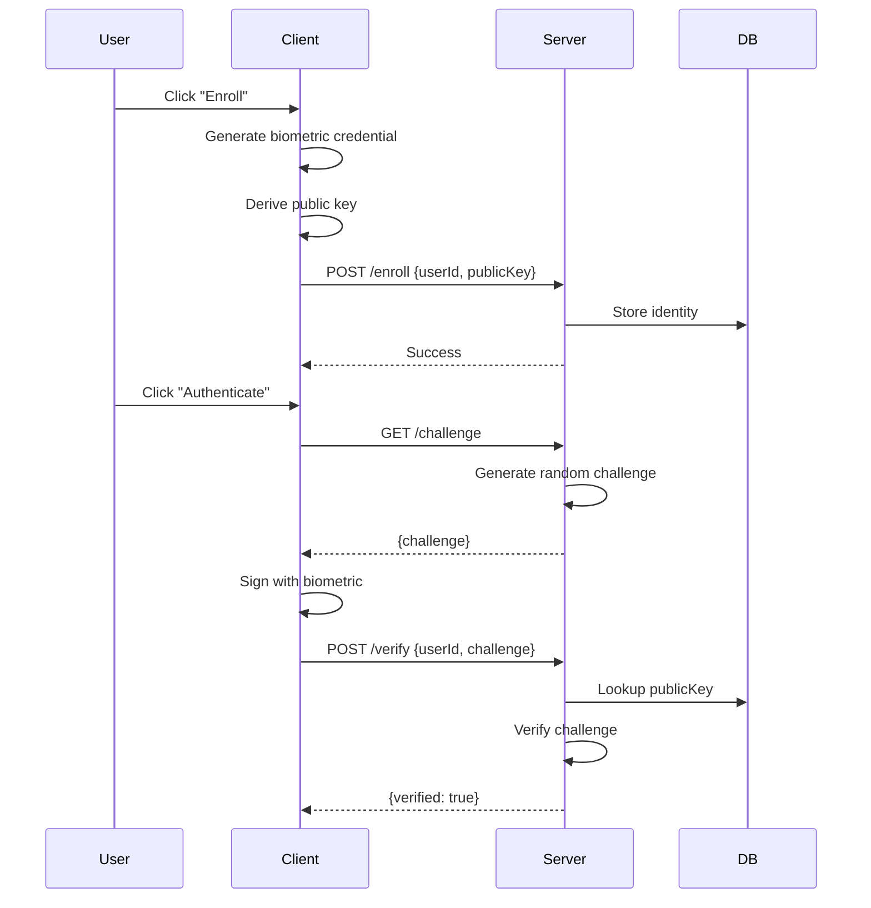

This example demonstrates a complete full-stack biometric authentication system with client-side enrollment and server-side verification.

## Architecture Overview

The full-stack BioKey system consists of:

1. **Client** - React app using `biokey-react` for biometric enrollment and authentication
2. **Server** - Node.js backend using `biokey-server` for challenge generation and verification
3. **Database** - Simple SQLite storage for user identities (can be replaced with any DB)



## Installation

### Client Dependencies

<CodeGroup>

```bash npm
npm install biokey-react biokey-js react react-dom
```

```bash yarn
yarn add biokey-react biokey-js react react-dom
```

</CodeGroup>

### Server Dependencies

<CodeGroup>

```bash npm
npm install hono better-sqlite3
```

```bash yarn
yarn add hono better-sqlite3
```

</CodeGroup>

## Complete Implementation

### Server Code

<CodeGroup>

```javascript server/index.js
import { Hono } from 'hono'
import { cors } from 'hono/cors'
import { initDB, saveIdentity, getIdentity, createChallenge, consumeChallenge } from './db.js'

const app = new Hono()

// Enable CORS for client requests
app.use('*', cors({
  origin: ['http://localhost:5173', 'http://localhost:3000'],
  credentials: true
}))

// Initialize database
initDB()

// Health check
app.get('/', (c) => {
  return c.json({ 
    name: 'biokey-server', 
    version: '1.0.0',
    endpoints: ['/enroll', '/challenge', '/verify']
  })
})

// Enroll new user
app.post('/enroll', async (c) => {
  const body = await c.req.json().catch(() => null)

  if (!body?.userId || !body?.publicKey || !body?.deviceId) {
    return c.json({ 
      error: 'Missing required fields: userId, publicKey, deviceId' 
    }, 400)
  }

  const { userId, publicKey, deviceId, method = 'prf' } = body

  // Validate public key format (64 hex chars = 32 bytes)
  if (typeof publicKey !== 'string' || publicKey.length !== 64) {
    return c.json({ error: 'Invalid publicKey format' }, 400)
  }

  try {
    saveIdentity(userId, publicKey, deviceId, method)
    console.log(`✓ Enrolled user: ${userId}`)
    return c.json({ 
      ok: true, 
      userId, 
      publicKey,
      method 
    })
  } catch (err) {
    console.error('Enrollment error:', err)
    return c.json({ 
      error: 'Enrollment failed', 
      detail: err.message 
    }, 500)
  }
})

// Generate authentication challenge
app.get('/challenge', (c) => {
  const challenge = createChallenge()
  console.log(`→ Generated challenge: ${challenge.slice(0, 16)}...`)
  return c.json({ challenge })
})

// Verify authentication
app.post('/verify', async (c) => {
  const body = await c.req.json().catch(() => null)

  if (!body?.userId || !body?.challenge) {
    return c.json({ 
      error: 'Missing required fields: userId, challenge' 
    }, 400)
  }

  const { userId, challenge } = body

  // Lookup user identity
  const identity = getIdentity(userId)
  if (!identity) {
    console.log(`✗ Unknown user: ${userId}`)
    return c.json({ error: 'Unknown userId' }, 404)
  }

  // Verify challenge is valid and not expired
  const valid = consumeChallenge(challenge)
  if (!valid) {
    console.log(`✗ Invalid/expired challenge for ${userId}`)
    return c.json({ error: 'Invalid or expired challenge' }, 401)
  }

  console.log(`✓ Verified user: ${userId}`)
  return c.json({ 
    verified: true, 
    publicKey: identity.public_key,
    userId,
    method: identity.method
  })
})

const port = process.env.PORT || 3000
console.log(`🚀 BioKey server running on http://localhost:${port}`)

export default {
  port,
  fetch: app.fetch
}
```

```javascript server/db.js
import Database from 'better-sqlite3'

const db = new Database('biokey.db')

export function initDB() {
  db.exec(`
    CREATE TABLE IF NOT EXISTS identities (
      user_id TEXT PRIMARY KEY,
      public_key TEXT NOT NULL,
      device_id TEXT,
      method TEXT DEFAULT 'prf',
      enrolled_at INTEGER DEFAULT (strftime('%s', 'now'))
    )
  `)

  db.exec(`
    CREATE TABLE IF NOT EXISTS challenges (
      challenge TEXT PRIMARY KEY,
      created_at INTEGER DEFAULT (strftime('%s', 'now'))
    )
  `)

  // Clean up old challenges (>5 minutes)
  setInterval(() => {
    const cutoff = Math.floor(Date.now() / 1000) - 300
    db.prepare('DELETE FROM challenges WHERE created_at < ?').run(cutoff)
  }, 60000)
}

export function saveIdentity(userId, publicKey, deviceId, method = 'prf') {
  const stmt = db.prepare(`
    INSERT OR REPLACE INTO identities (user_id, public_key, device_id, method)
    VALUES (?, ?, ?, ?)
  `)
  return stmt.run(userId, publicKey, deviceId, method)
}

export function getIdentity(userId) {
  const stmt = db.prepare('SELECT * FROM identities WHERE user_id = ?')
  return stmt.get(userId)
}

export function createChallenge() {
  const challenge = [...crypto.getRandomValues(new Uint8Array(32))]
    .map(b => b.toString(16).padStart(2, '0'))
    .join('')
  
  const stmt = db.prepare('INSERT INTO challenges (challenge) VALUES (?)')
  stmt.run(challenge)
  
  return challenge
}

export function consumeChallenge(challenge) {
  const stmt = db.prepare('DELETE FROM challenges WHERE challenge = ?')
  const result = stmt.run(challenge)
  return result.changes > 0
}
```

```json server/package.json
{
  "name": "biokey-server-example",
  "version": "1.0.0",
  "type": "module",
  "scripts": {
    "dev": "bun --watch index.js",
    "start": "node index.js"
  },
  "dependencies": {
    "hono": "^4.4.0",
    "better-sqlite3": "^11.0.0"
  }
}
```

</CodeGroup>

### Client Code

<CodeGroup>

```jsx client/src/App.jsx
import { useBioKey } from 'biokey-react'
import { useState, useEffect } from 'react'
import './App.css'

const SERVER_URL = 'http://localhost:3000'

function App() {
  const { 
    identity, 
    status, 
    error, 
    isEnrolled, 
    isLoading,
    enroll, 
    authenticate,
    reset
  } = useBioKey({
    rpName: 'BioKey Full-Stack Demo',
    serverUrl: SERVER_URL
  })

  const [userId, setUserId] = useState('demo@example.com')
  const [serverStatus, setServerStatus] = useState('checking...')
  const [lastAuth, setLastAuth] = useState(null)

  // Check server health on mount
  useEffect(() => {
    fetch(SERVER_URL)
      .then(res => res.json())
      .then(data => setServerStatus(`✓ ${data.name} v${data.version}`))
      .catch(() => setServerStatus('✗ Server offline'))
  }, [])

  const handleEnroll = async () => {
    try {
      const result = await enroll(userId)
      console.log('Enrollment result:', result)
    } catch (err) {
      console.error('Enrollment failed:', err)
    }
  }

  const handleAuth = async () => {
    try {
      const result = await authenticate(userId)
      setLastAuth({
        time: new Date().toLocaleTimeString(),
        verified: result.verified,
        method: result.method
      })
      console.log('Authentication result:', result)
    } catch (err) {
      console.error('Authentication failed:', err)
      setLastAuth(null)
    }
  }

  const formatKey = (key) => {
    if (!key) return ''
    return key.match(/.{8}/g).join(' ')
  }

  return (
    <div className="app">
      <header className="header">
        <h1>BioKey Full-Stack Demo</h1>
        <p className="server-status">{serverStatus}</p>
      </header>

      <div className="card">
        <div className="status-section">
          <div className="status-badge">
            <span className={`badge ${isEnrolled ? 'enrolled' : ''}`}>
              {isEnrolled ? '✓ Enrolled' : 'Not Enrolled'}
            </span>
            {status !== 'idle' && (
              <span className="status-text">{status}</span>
            )}
          </div>

          {isEnrolled && identity && (
            <div className="identity-card">
              <div className="identity-field">
                <label>Identity Key</label>
                <code>{formatKey(identity.publicKey)}</code>
              </div>
              <div className="identity-metadata">
                <span>Method: <strong>{identity.method}</strong></span>
                <span>Device: <strong>{identity.deviceId}</strong></span>
              </div>
            </div>
          )}

          {lastAuth && (
            <div className="auth-success">
              ✓ Authentication successful at {lastAuth.time}
              <br />
              <small>Method: {lastAuth.method}</small>
            </div>
          )}
        </div>

        {error && (
          <div className="error-box">
            <strong>Error:</strong> {error}
          </div>
        )}

        {!isEnrolled && (
          <div className="form-group">
            <label htmlFor="userId">User ID / Email</label>
            <input
              id="userId"
              type="email"
              value={userId}
              onChange={(e) => setUserId(e.target.value)}
              placeholder="user@example.com"
            />
          </div>
        )}

        <div className="actions">
          {!isEnrolled ? (
            <button 
              onClick={handleEnroll} 
              disabled={isLoading || !userId}
              className="btn btn-primary"
            >
              {isLoading ? '⏳ Waiting for biometric...' : '🔐 Enroll Biometric'}
            </button>
          ) : (
            <>
              <button 
                onClick={handleAuth} 
                disabled={isLoading}
                className="btn btn-success"
              >
                {isLoading ? '⏳ Authenticating...' : '✓ Authenticate'}
              </button>
              <button 
                onClick={() => {
                  reset()
                  setLastAuth(null)
                }}
                className="btn btn-ghost"
              >
                Reset
              </button>
            </>
          )}
        </div>

        <div className="info-box">
          <p><strong>How it works:</strong></p>
          <ol>
            <li>Client derives identity key from biometric</li>
            <li>Server stores public key for verification</li>
            <li>Server generates challenge for authentication</li>
            <li>Client proves identity without sending biometric data</li>
          </ol>
        </div>
      </div>
    </div>
  )
}

export default App
```

```css client/src/App.css
.app {
  min-height: 100vh;
  background: linear-gradient(135deg, #667eea 0%, #764ba2 100%);
  padding: 40px 20px;
}

.header {
  text-align: center;
  color: white;
  margin-bottom: 40px;
}

.header h1 {
  font-size: 36px;
  margin-bottom: 8px;
}

.server-status {
  font-size: 14px;
  opacity: 0.9;
  font-family: monospace;
}

.card {
  background: white;
  border-radius: 16px;
  box-shadow: 0 20px 60px rgba(0, 0, 0, 0.3);
  padding: 40px;
  max-width: 600px;
  margin: 0 auto;
}

.status-section {
  margin-bottom: 24px;
}

.status-badge {
  display: flex;
  justify-content: space-between;
  align-items: center;
  padding: 16px 20px;
  background: #f7fafc;
  border-radius: 10px;
  margin-bottom: 20px;
}

.badge {
  padding: 8px 16px;
  border-radius: 20px;
  font-size: 14px;
  font-weight: 700;
  background: #e2e8f0;
  color: #4a5568;
}

.badge.enrolled {
  background: #c6f6d5;
  color: #22543d;
}

.status-text {
  font-size: 13px;
  color: #718096;
  text-transform: capitalize;
}

.identity-card {
  background: #f7fafc;
  border-radius: 10px;
  padding: 20px;
  margin-bottom: 16px;
}

.identity-field label {
  display: block;
  font-size: 11px;
  font-weight: 700;
  color: #718096;
  text-transform: uppercase;
  letter-spacing: 0.5px;
  margin-bottom: 8px;
}

.identity-field code {
  display: block;
  font-family: 'Monaco', 'Courier New', monospace;
  font-size: 11px;
  background: white;
  padding: 14px;
  border-radius: 8px;
  word-break: break-all;
  color: #2d3748;
  line-height: 1.6;
}

.identity-metadata {
  display: flex;
  gap: 20px;
  margin-top: 16px;
  padding-top: 16px;
  border-top: 1px solid #e2e8f0;
  font-size: 13px;
  color: #718096;
}

.auth-success {
  background: #c6f6d5;
  color: #22543d;
  padding: 14px 18px;
  border-radius: 8px;
  margin-bottom: 16px;
  font-size: 14px;
  line-height: 1.6;
}

.error-box {
  background: #fed7d7;
  color: #742a2a;
  border: 1px solid #fc8181;
  padding: 14px 18px;
  border-radius: 8px;
  margin-bottom: 20px;
}

.form-group {
  margin-bottom: 24px;
}

.form-group label {
  display: block;
  font-size: 14px;
  font-weight: 600;
  color: #2d3748;
  margin-bottom: 8px;
}

.form-group input {
  width: 100%;
  padding: 12px 16px;
  border: 2px solid #e2e8f0;
  border-radius: 8px;
  font-size: 15px;
  transition: border-color 0.2s;
}

.form-group input:focus {
  outline: none;
  border-color: #667eea;
}

.actions {
  display: flex;
  gap: 12px;
  margin-bottom: 24px;
}

.btn {
  flex: 1;
  padding: 14px 24px;
  border: none;
  border-radius: 8px;
  font-size: 15px;
  font-weight: 600;
  cursor: pointer;
  transition: all 0.2s;
}

.btn:disabled {
  opacity: 0.5;
  cursor: not-allowed;
}

.btn-primary {
  background: #667eea;
  color: white;
}

.btn-primary:hover:not(:disabled) {
  background: #5a67d8;
  transform: translateY(-1px);
}

.btn-success {
  background: #48bb78;
  color: white;
}

.btn-success:hover:not(:disabled) {
  background: #38a169;
  transform: translateY(-1px);
}

.btn-ghost {
  background: transparent;
  color: #e53e3e;
  border: 2px solid #e53e3e;
}

.btn-ghost:hover {
  background: #fff5f5;
}

.info-box {
  background: #edf2f7;
  border-left: 4px solid #667eea;
  padding: 20px;
  border-radius: 8px;
}

.info-box p {
  margin: 0 0 12px 0;
  color: #2d3748;
  font-weight: 600;
}

.info-box ol {
  margin: 0;
  padding-left: 20px;
  color: #4a5568;
  font-size: 14px;
  line-height: 1.8;
}
```

```json client/package.json
{
  "name": "biokey-client-example",
  "private": true,
  "version": "0.0.0",
  "type": "module",
  "scripts": {
    "dev": "vite",
    "build": "vite build",
    "preview": "vite preview"
  },
  "dependencies": {
    "react": "^18.2.0",
    "react-dom": "^18.2.0",
    "biokey-react": "latest",
    "biokey-js": "latest"
  },
  "devDependencies": {
    "@vitejs/plugin-react": "^4.0.0",
    "vite": "^5.0.0"
  }
}
```

</CodeGroup>

## Running the Full-Stack App

<Steps>
  <Step title="Start the Server">
    ```bash
    cd server
    npm install
    npm run dev
    ```
    Server will run on `http://localhost:3000`
  </Step>
  
  <Step title="Start the Client">
    ```bash
    cd client
    npm install
    npm run dev
    ```
    Client will run on `http://localhost:5173`
  </Step>
  
  <Step title="Test the Flow">
    1. Open `http://localhost:5173` in your browser
    2. Click "Enroll Biometric" and use your fingerprint
    3. Click "Authenticate" to verify your identity
    4. Check the server logs to see the verification flow
  </Step>
</Steps>

## API Endpoints

### POST /enroll

Enroll a new user identity.

**Request:**
```json
{
  "userId": "user@example.com",
  "publicKey": "a1b2c3d4...",
  "deviceId": "device123",
  "method": "prf"
}
```

**Response:**
```json
{
  "ok": true,
  "userId": "user@example.com",
  "publicKey": "a1b2c3d4...",
  "method": "prf"
}
```

### GET /challenge

Generate a random authentication challenge.

**Response:**
```json
{
  "challenge": "a1b2c3d4e5f6..."
}
```

### POST /verify

Verify user authentication.

**Request:**
```json
{
  "userId": "user@example.com",
  "challenge": "a1b2c3d4e5f6..."
}
```

**Response:**
```json
{
  "verified": true,
  "publicKey": "a1b2c3d4...",
  "userId": "user@example.com",
  "method": "prf"
}
```

## Security Considerations

<AccordionGroup>
  <Accordion title="Challenge Expiry">
    Challenges expire after 5 minutes to prevent replay attacks. The server automatically cleans up old challenges.
  </Accordion>
  
  <Accordion title="HTTPS Requirement">
    WebAuthn requires HTTPS in production. Use a reverse proxy like Caddy or nginx with SSL certificates.
  </Accordion>
  
  <Accordion title="Rate Limiting">
    Add rate limiting to prevent brute-force attacks:
    ```javascript
    import { rateLimiter } from 'hono-rate-limiter'
    
    app.use('/verify', rateLimiter({
      windowMs: 15 * 60 * 1000, // 15 minutes
      max: 5 // 5 attempts
    }))
    ```
  </Accordion>
  
  <Accordion title="Database Security">
    - Use parameterized queries (already implemented)
    - Hash sensitive data before storage
    - Implement proper access controls
    - Regular backups
  </Accordion>
</AccordionGroup>

## Production Deployment

### Deploy Server

<CodeGroup>

```yaml Railway
services:
  biokey-server:
    build:
      dockerfile: Dockerfile
    env:
      NODE_ENV: production
    healthcheck:
      endpoint: /
      interval: 30
```

```dockerfile Dockerfile
FROM oven/bun:1

WORKDIR /app

COPY package.json .
RUN bun install --production

COPY . .

EXPOSE 3000

CMD ["bun", "start"]
```

```json Vercel
{
  "builds": [
    { "src": "index.js", "use": "@vercel/node" }
  ],
  "routes": [
    { "src": "/(.*)", "dest": "index.js" }
  ]
}
```

</CodeGroup>

### Deploy Client

```bash Vercel
cd client
npm run build
vercel --prod
```

<Warning>
**Update SERVER_URL**: Change the `SERVER_URL` constant in `App.jsx` to your production server URL.
</Warning>

## Next Steps

<CardGroup cols={2}>
  <Card title="Server API Reference" icon="server" href="/api/biokey-server/endpoints">
    Complete API documentation for biokey-server
  </Card>
  <Card title="Security Guide" icon="shield" href="/concepts/security-model">
    Best practices for production deployments
  </Card>
</CardGroup>
